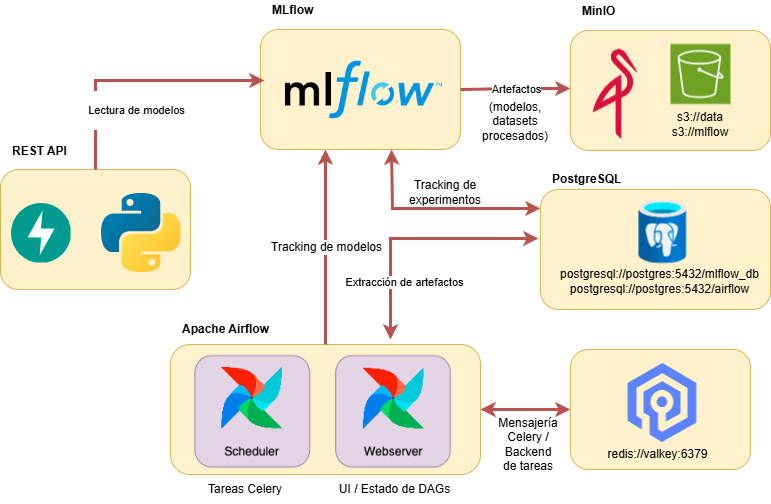

#  CEIA - Operaciones de aprendizaje automático I | Proyecto Final

Repositorio para el proyecto final de la materia **Operaciones de aprendizaje automático I** de la Carrera de Especialización en Inteligencia Artificial (CEIA - UBA).

---

## 👥 Integrantes del Grupo

- **Martin Brocca** (<martinbrocca@gmail.com>)
- **Natalia Espector** (<nataliaespector@gmail.com>)
- **Emiliano Iparraguirre** (<emiliano.iparraguirre22@gmail.com>)
- **Agustin Lopez Fredes** (<agustin.lopezfredes@gmail.com>)
- **Fermin Rodriguez del Castillo** (<ferkrodriguez98@gmail.com>)

---

# Proyecto Final de MLOps1

Este proyecto tiene como objetivo desplegar un entorno **end-to-end** de MLOps que:
- Orquesta procesos de ETL y entrenamiento de modelos con **Apache Airflow**.
- Realiza **búsqueda de hiperparámetros** y tracking de experimentos con **MLflow**.
- Simula un entorno productivo con contenedores Docker para todos los servicios involucrados.
- Permite **servir modelos** a través de una API REST (FastAPI).
- Utiliza **MinIO** como Data Lake (simulación de Amazon S3) para almacenamiento de datos y artefactos.

## 🗂️ Servicios incluidos

- [Apache Airflow](https://airflow.apache.org/) – Orquestación de pipelines y ejecución de DAGs.
- [MLflow](https://mlflow.org/) – Tracking de experimentos, registro de modelos y métricas.
- [FastAPI](https://fastapi.tiangolo.com/) – API REST para servir modelos.
- [MinIO](https://min.io/) – Almacenamiento de datos tipo S3.
- [PostgreSQL](https://www.postgresql.org/) – Base de datos relacional (para MLflow y Airflow).
- [ValKey](https://valkey.io/) – Base de datos key-value utilizada por Airflow internamente.



Por defecto, al iniciar el entorno se crean los siguientes **buckets**:

- `s3://data`
- `s3://mlflow` (usado por MLflow para guardar artefactos)

Y las siguientes **bases de datos**:

- `mlflow_db` (para MLflow)
- `airflow` (para Airflow)

---

## 🎯 Objetivo del proyecto

Implementar modelos de aprendizaje de máquina en un entorno productivo simulado con **Docker Compose**. Los DAGs incluidos realizan:

- **Optimización de hiperparámetros** (con [Optuna](https://optuna.org/)) en 10 corridas rápidas para acortar los tiempos de ejecución.
- Tracking de métricas y parámetros en **MLflow**.
- Registro de modelos en un **experimento común** que centraliza la comparación de performance.

Cada DAG tiene como objetivo **entrenar y comparar modelos supervisados de clasificación** con diferentes algoritmos (KNN, SVM y LightGBM).

---

## 📜 DAGs implementados

### `etl_mlflow.py`
Este DAG realiza un **pipeline ETL** (Extract – Transform – Load) sobre los datos de empleados que luego usarán los modelos:
- **Extract:** descarga desde MinIO el dataset crudo (`enriched_employee_dataset.csv`).
- **Transform:** limpia columnas irrelevantes, elimina valores nulos, divide los datos en train/test y realiza imputaciones.
- **Load:** sube los datasets procesados (`X_train`, `X_test`, `y_train`, `y_test`) al bucket `processed` en MinIO.
- **Trackeo del ETL en MLflow**:
- Loguea parámetros (por ejemplo, columnas eliminadas, split ratio).
- Loguea métricas (cantidad de filas, missing values antes y después de limpiar).
- Loguea artefactos (datasets procesados) y estadísticas descriptivas (media, desviación estándar de cada feature).
- También sube los archivos finales a MinIO para que otros DAGs los usen.

### `dag_knn.py`
DAG que entrena un modelo de clasificación **K-Nearest Neighbors (KNN)**:
- Descarga los datos procesados desde MinIO.
- Ejecuta **10 trials con Optuna** para optimizar hiperparámetros (`n_neighbors`, `weights`, `algorithm`).
- Registra en MLflow los resultados de cada trial en el experimento `knn_optuna` (F1 y parámetros).
- Entrena un modelo final con los mejores parámetros.
- Evalúa el modelo y guarda en un **experimento común**:
  - F1, precision, recall.
  - Matriz de confusión (como imagen).
  - Parámetros finales y el modelo entrenado.

### `dag_svm.py`
DAG que entrena un modelo de **Support Vector Machine (SVM)** con el mismo flujo que KNN:
- Descarga datos desde MinIO.
- Corre 10 trials de Optuna optimizando `C`, `kernel` y `gamma`.
- Guarda métricas y parámetros en `svm_optuna`.
- Entrena el mejor modelo y lo registra en el **experimento común** junto con todas las métricas y artefactos.

### `dag_lightgbm.py`
DAG que entrena un modelo de **LightGBM**:
- Descarga datos procesados desde MinIO.
- Ejecuta 10 trials de Optuna optimizando parámetros clave (`n_estimators`, `learning_rate`, `max_depth`, `num_leaves`, `subsample`, `colsample_bytree`).
- Registra los trials en `lightgbm_optuna` y entrena un modelo final con los mejores parámetros.
- Loguea en MLflow métricas, matriz de confusión y modelo final. A diferencia de los anteriores, usa `mlflow.lightgbm.log_model` para registrar el modelo final.

---

## ⚙️ Instalación y configuración

### 1️⃣ Instalar Docker
Instalá [Docker Desktop](https://docs.docker.com/engine/install/) en tu computadora.

### 2️⃣ Clonar el repositorio
```bash
git clone https://github.com/martinbrocca/CEIA-MLops.git
cd CEIA-MLops
```

### 3️⃣ Crear carpetas necesarias
```bash
mkdir -p airflow/config airflow/dags airflow/logs airflow/plugins
```

### 4️⃣ Ajustar UID de Airflow (solo en Linux/MacOS)
Editá `.env` y reemplazá `AIRFLOW_UID` por el de tu usuario:
```bash
id -u <username>
```

### 5️⃣ Levantar todos los servicios
```bash
docker compose --profile all up
```

📍 **Accesos:**
- Apache Airflow → [http://localhost:8080](http://localhost:8080)
- MLflow → [http://localhost:5001](http://localhost:5001)
- MinIO → [http://localhost:9001](http://localhost:9001)
- API REST → [http://localhost:8800/](http://localhost:8800/)
- Docs API (Swagger) → [http://localhost:8800/docs](http://localhost:8800/docs)

⚠️ **LightGBM:**
Si vas a correr el DAG de LightGBM, ejecutá un rebuild antes:
```bash
docker compose --profile all up --build
```

---

## ⏹️ Cómo apagar los servicios

Cuando no uses los servicios, podés apagarlos para liberar memoria:

```bash
docker compose --profile all down
```

Para **eliminar toda la infraestructura** (imágenes, volúmenes y datos):

```bash
docker compose down --rmi all --volumes
```

📌 **Nota:** Esto borra todos los buckets y bases de datos.

---

## ⚠️ Consideraciones para entornos Windows

En Windows, para evitar conflictos al reconstruir la imagen de Airflow, se recomienda **crear la imagen solo una vez** y que todos los servicios la utilicen, en vez de que cada uno intente reconstruirla.

En Windows, Docker Desktop maneja las rutas de forma diferente y puede provocar que **cada servicio de Airflow intente reconstruir la imagen `extending_airflow` en paralelo**. Esto genera errores como:

- image already exists (la imagen ya existe)
- conflictos de acceso a archivos temporales
- builds interrumpidos y contenedores que no terminan de levantarse

Para evitar estos problemas, lo mejor es **crear la imagen una sola vez** y luego indicarle a todos los servicios de Airflow que usen esa imagen, en vez de dejar que cada contenedor intente reconstruirla.

📌 **1️⃣ Construir la imagen de Airflow manualmente**
Desde la raíz del proyecto (CEIA-MLops), ejecutá:

```powershell
docker build -t extending_airflow:latest ./dockerfiles/airflow
```

✅ Esto dejará lista una imagen llamada `extending_airflow:latest`.

📌 **2️⃣ Editar docker-compose.yml**

Buscá el bloque:

```yaml
x-airflow-common: &airflow-common
  build: './dockerfiles/airflow'
  image: ${AIRFLOW_IMAGE_NAME:-extending_airflow}
  profiles:
    - airflow
    - all
```

**Borrá la línea de `build:`** y dejalo así:

```yaml
x-airflow-common: &airflow-common
  image: extending_airflow:latest
  profiles:
    - airflow
    - all
```

👉 Esto le indica a Docker Compose que ya existe la imagen y no tiene que construirla cada vez.

📌 **3️⃣ Levantar todos los servicios**

Ahora corré:

```powershell
docker compose --profile all up
```

---

## 🔧 Airflow – detalles importantes

### Variables de entorno
Podés modificar las variables de entorno de Airflow en `docker-compose.yml` dentro de `x-airflow-common`. Más info: [configuración de Airflow](https://airflow.apache.org/docs/apache-airflow/stable/configurations-ref.html).

### Ejecutor Celery
Airflow usa [Celery Executor](https://airflow.apache.org/docs/apache-airflow/stable/core-concepts/executor/celery.html), lo que significa que las tareas se ejecutan en contenedores separados (workers).

### CLI de Airflow
Para usar la CLI:
```bash
docker compose --profile all --profile debug up
```
Luego, por ejemplo:
```bash
docker-compose run airflow-cli config list
```
Más info: [CLI de Airflow](https://airflow.apache.org/docs/apache-airflow/stable/cli-and-env-variables-ref.html).

### Variables y conexiones
- Variables: `secrets/variables.yaml`
- Conexiones: `secrets/connections.yaml`

Las conexiones agregadas en la UI **no persisten** si borrás los contenedores. Las definidas en YAML sí persisten, pero **no aparecen** en la UI.

---

## ☁️ Conexión con MinIO

Variables de entorno:
```bash
AWS_ACCESS_KEY_ID=minio
AWS_SECRET_ACCESS_KEY=minio123
AWS_ENDPOINT_URL_S3=http://localhost:9000
```

MLflow necesita:
```bash
MLFLOW_S3_ENDPOINT_URL=http://localhost:9000
```

Esto permite usar `boto3`, `awswrangler`, etc. como si fuera un S3 real.

⚠️ Si trabajás con AWS real, cuidado de no sobreescribir tus credenciales.

---

## 🗄️ Valkey

Valkey es usado por Airflow para manejar su backend. Actualmente no expone su puerto, pero puede modificarse el `docker-compose.yml` si quisieras usarlo externamente.

---

### ✅ Estado actual
✔️ Infraestructura Docker lista.
✔️ DAGs de **KNN, SVM y LightGBM** para optimización y comparación de modelos.
✔️ Tracking en MLflow.
✔️ API REST básica en FastAPI.